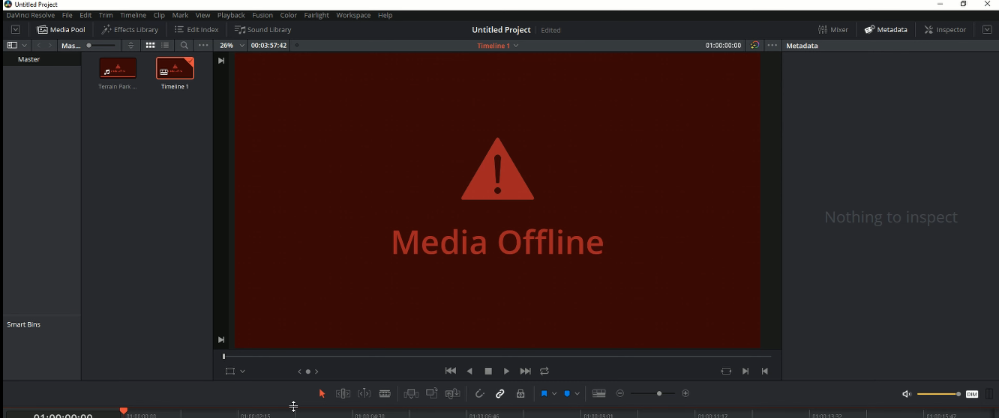
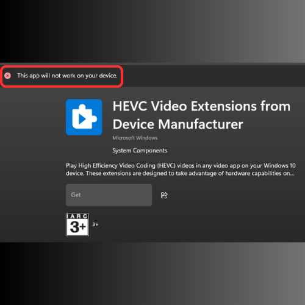

# Fixing the DaVinci Resolve "Media Offline" Error (HEVC Codec Issue)

Have you ever encountered the frustrating **"Media Offline"** error in DaVinci Resolve, especially when trying to import footage from phones, drones, or screen recordings?

*(Replace `error_image_1.png` with the actual filename of your first error image)*

This often happens on Windows systems because the necessary HEVC (H.265) video codecs are missing or not properly licensed.

Here's how you can fix it using two easy methods:

---

## Method 1: Official Microsoft Store HEVC Extension

This method attempts to install the official HEVC extension from the Microsoft Store.

1.  **Visit the Link:** Go to the Microsoft Store page for the **"HEVC Video Extensions from Device Manufacturer"**:
    [https://apps.microsoft.com/detail/9n4wgh0z6vhq?hl=en-US&gl=US](https://apps.microsoft.com/detail/9n4wgh0z6vhq?hl=en-US&gl=US)

2.  **Install:** Click the **"Get"** or **"Install"** button to add the extension to your Windows system.

⚠️ **Potential Issue:** If you encounter an error during installation, like the one shown below, it might mean this specific package isn't compatible with your hardware or Windows version. If this happens, don't worry! Just proceed to **Method 2**.

*(Replace `error_image_2.png` with the actual filename of your second error image)*

---

## Method 2: Alternative HEVC Extension Package

This method uses a downloadable HEVC extension package that often works on devices where Method 1 fails.

1.  **Visit the Link:** Go to this shared Google Drive folder containing the alternative HEVC extension:
    [Google Drive Link](https://drive.google.com/drive/folders/1lob6w_mSZxn-2AbrchREHQBveDm-sAdc?usp=sharing)
    *(Disclaimer: Download and install files from third-party sources at your own risk.)*

2.  **Download:** Download the file(s) from the shared folder. It will likely be an `.appx` or similar package file.

3.  **Install:** Locate the downloaded file on your computer and **double-click** it. This should open the Microsoft Store installer. Follow the prompts to install the extension.

---

## Final Step: Restart DaVinci Resolve

After you have successfully installed the HEVC extensions using **either Method 1 or Method 2**:

1.  **Close DaVinci Resolve completely.** Ensure it's not running in the background.
2.  **Re-launch DaVinci Resolve.**

**Et Voilà! 🎉**

Open your project again. The "Media Offline" warnings for your HEVC files should now be gone, and your footage should display correctly. Happy editing!